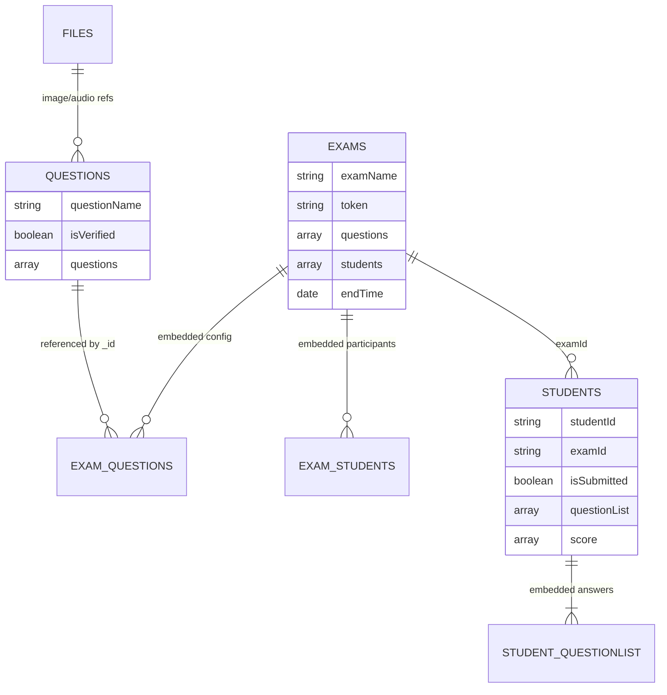
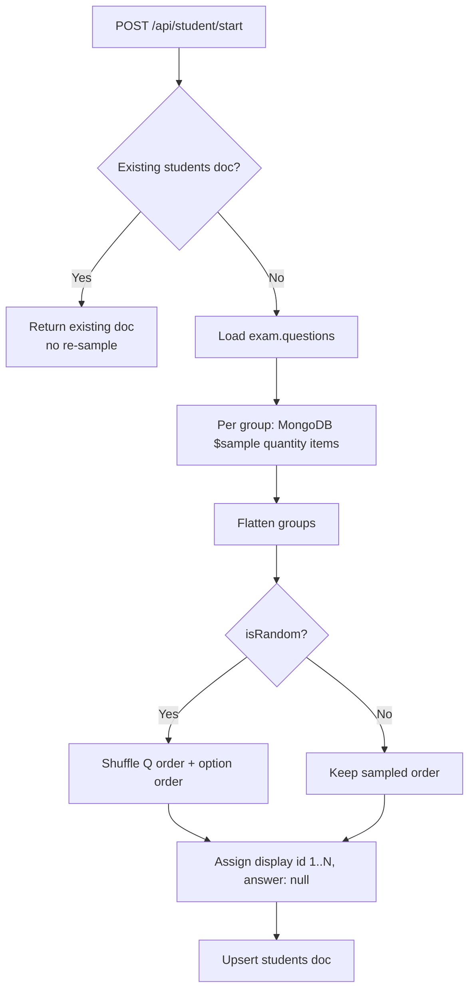
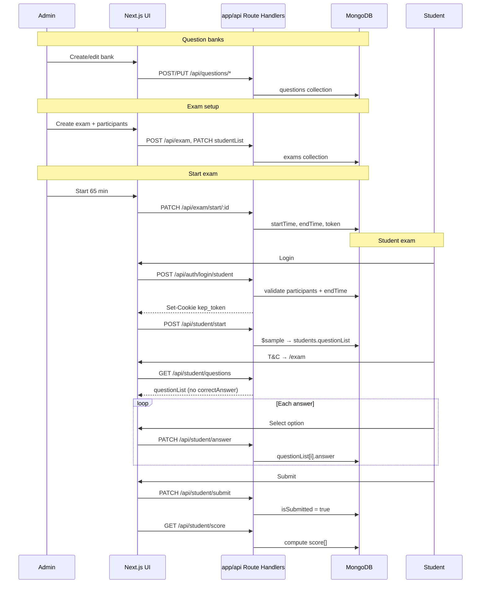

# Data Flow — Question Bank to Student Submission

End-to-end audit of how data moves through the KEP Unklab Exam application: from
creating question banks, through exam setup and start, to students answering and
submitting. This document describes the **Next.js full-stack app only** (`src/app/` +
`src/lib/` + MongoDB). The legacy NestJS API repo is retired.

**See also:** [Data model](./data-model/data-overview.md) · [App flow & local run](./app-flow.md)

---

## 1. Architecture overview

One process serves both UI and API. The browser calls same-origin `/api/*`; Route
Handlers delegate to service modules that read and write MongoDB via Mongoose.

```
┌─────────────────────────────────────────────────────────────────┐
│  Browser (Admin / Student)                                       │
└───────────────────────────┬─────────────────────────────────────┘
                            │ axios → /api  (withCredentials: true)
                            ▼
┌─────────────────────────────────────────────────────────────────┐
│  Next.js 15                                                      │
│  src/middleware.js      → JWT + role gate on pages/routes        │
│  src/app/api/**/route.js → requireAuth, parse request            │
│  src/lib/services/*     → business logic                         │
│  src/lib/models/*       → Mongoose schemas                       │
│  httpOnly cookie        → kep_token (JWT, 24h)                   │
└───────────────────────────┬─────────────────────────────────────┘
                            │ Mongoose
                            ▼
┌─────────────────────────────────────────────────────────────────┐
│  MongoDB                                                         │
│  collections: questions, exams, students, users, files           │
└─────────────────────────────────────────────────────────────────┘
```

| Layer      | Path                                 | Role                                 |
| ---------- | ------------------------------------ | ------------------------------------ |
| UI pages   | `src/app/`                           | Login, exam, score, admin dashboard  |
| API routes | `src/app/api/**/route.js`            | HTTP boundary                        |
| Services   | `src/lib/services/*.js`              | Exam, questions, student, file logic |
| Models     | `src/lib/models/*.js`                | Schema definitions                   |
| Client     | `src/lib/api/client.js`              | Axios instance (`baseURL: '/api'`)   |
| Auth       | `src/lib/auth/`, `src/middleware.js` | JWT sign/verify, cookie, role checks |

There is **no separate backend service** and no proxy to an external API.

---

## 2. Data model

MongoDB uses **embedded documents**, not relational foreign keys. There is **no
separate `answers` collection** — answers live on each student's `questionList`.

### Collections

| Collection  | Document                    | Key fields                                                                      |
| ----------- | --------------------------- | ------------------------------------------------------------------------------- |
| `questions` | Question **bank**           | `questionName`, `isVerified`, `questions[]`                                     |
| `exams`     | Exam session + participants | `examName`, `token`, `questions[]`, `students[]`, flags, `startTime`, `endTime` |
| `students`  | Per-student **attempt**     | `(studentId, examId)`, `questionList[]`, `score[]`, `isSubmitted`               |
| `users`     | Admin account               | `username`, `password` (bcrypt), `role`                                         |
| `files`     | Media metadata              | `name`, `base64`, `path`, `type`                                                |

### Relationships



### Question item (inside a bank)

```json
{
  "id": 1,
  "text": "Question stem…",
  "correctAnswer": 2,
  "options": [
    { "id": 1, "text": "Option A" },
    { "id": 2, "text": "Option B" }
  ],
  "image": "<fileId or null>",
  "audio": "<fileId or null>"
}
```

`correctAnswer` is the **1-based option id**.

### Exam question-group config (embedded on exam)

```json
{
  "_id": "<questions collection _id>",
  "questionName": "Reading",
  "quantity": 10,
  "questionLength": 25
}
```

- `_id` — which bank to sample from
- `quantity` — how many items to draw randomly from that bank
- `questionLength` — total items in bank (UI validation; server caps quantity)

### Student submission document

Created on `POST /api/student/start`, not at login:

```json
{
  "studentId": "S2200001",
  "studentName": "Jane Doe",
  "examId": "<exam _id>",
  "examName": "KEP 2026",
  "isSubmitted": false,
  "questionList": [],
  "score": null
}
```

Each `questionList` entry includes `questionOrigin: { questionId, questionName }`
for per-group scoring.

---

## 3. Phase A — Question bank (Admin)

### UI

| Step | Page                                | Action                               |
| ---- | ----------------------------------- | ------------------------------------ |
| 1    | `/dashboard/questions`              | List, create, rename, delete banks   |
| 2    | `/dashboard/questions/[questionId]` | Edit items, CSV import, upload media |
| 3    | Save                                | Auto-save every 5s or manual save    |

### API chain

| Method   | Route                       | Handler → service                |
| -------- | --------------------------- | -------------------------------- |
| `POST`   | `/api/questions`            | `questions.service.create`       |
| `GET`    | `/api/questions/:id`        | `questions.service.findOne`      |
| `PUT`    | `/api/questions/update/:id` | `verify()` + `updateQuestions`   |
| `PATCH`  | `/api/questions/import/:id` | `importQuestion` (CSV/XLSX)      |
| `POST`   | `/api/file`                 | file upload → `files` collection |
| `PATCH`  | `/api/questions/name/:id`   | rename bank                      |
| `DELETE` | `/api/questions/:id`        | delete bank                      |

### Save behaviour (`PUT /api/questions/update/:id`)

1. `questions.service.verify()` — each item needs `text`, option texts, `correctAnswer`.
2. Pass → `isVerified: true`; fail → `isVerified: false`, `400` response.
3. Full `questions[]` array is **replaced** on the document.
4. Only **verified** banks appear in exam creation (`ExamModal.jsx` filters `isVerified`).

### CSV import

Columns (flexible aliases): `text`, `option1`–`option5`, `correctAnswer`, `audio`, `image`.
Import sets `isVerified: true` after successful parse.

### State after Phase A

```
questions: { _id, questionName, isVerified: true, questions: [ …N items… ] }
```

---

## 4. Phase B — Exam creation (Admin)

### UI

`/dashboard/exams` → **Create Exam** modal → select verified groups and set `quantity` per group → `POST /api/exam/:examName`.

### Request body

```javascript
[
  {
    _id: '<bankId>',
    questionName: 'Reading',
    quantity: 10,
    questionLength: 25,
  },
];
```

### Service (`src/lib/services/exam.service.js` → `create`)

1. Random **6-digit `token`**.
2. Insert `exams` document:

```javascript
{
  token: "482917",
  examName: "KEP Placement 2026",
  questions: [ /* QuestionInfoDto[] */ ],
  students: null,
  isRandom: false,
  isShowScore: true,
  isShowAnswer: false
  // startTime / endTime unset
}
```

3. `verifyQuestionInfo()` — at least one group, `quantity >= 1`, cap to bank size.

Students **cannot log in** yet (`endTime` is null).

---

## 5. Phase C — Participants and configuration (Admin)

On `/dashboard/exams/[examId]`:

| Action              | API                               | Data written                              |
| ------------------- | --------------------------------- | ----------------------------------------- |
| Upload participants | `PATCH /api/exam/studentList/:id` | `exam.students[]`                         |
| Toggle flags        | `PATCH /api/exam/switch/:id`      | `isRandom`, `isShowScore`, `isShowAnswer` |
| Rename              | `PATCH /api/exam/name/:id`        | `examName`                                |

### Participant list parsing

Spreadsheet rows: `number | studentId | studentName`. If `studentId` contains
`"ID / nim"`, only the part before `/` is kept.

```javascript
exam.students = [
  { number: '1', studentId: 'S2200001', studentName: 'Jane Doe' },
];
```

Participants are **embedded on the exam document** (not a separate collection).

---

## 6. Phase D — Admin starts the exam

| Action              | API                                                |
| ------------------- | -------------------------------------------------- |
| Start (e.g. 65 min) | `PATCH /api/exam/start/:id?minute=65`              |
| Stop early          | `PATCH /api/exam/start/:id?minute=0`               |
| Custom token        | `PATCH /api/exam/start/:id?minute=65&token=123456` |

### Service (`exam.service.start`)

1. `startTime = now`
2. `endTime = now + minute × 60 × 1000`
3. Token: admin-supplied or new 6-digit (retry on duplicate)
4. Returns `{ token, time: secondsRemaining }`

### Login gate (`src/lib/auth/signIn.js` → `signInStudent`)

```javascript
if (!exam.endTime || endTime < now) → 403  // not started or expired
if token mismatch → 401
if studentId not in exam.students → 401
```

---

## 7. Phase E — Student login and session

### UI (`src/app/page.jsx`)

1. Student ID + exam token.
2. `sessionStorage.clear()` on login.

### API sequence

```
POST /api/auth/login/student  { studentId, token }
  → validates exam + participants + time window
  → signJwt → Set-Cookie: kep_token
  → returns { studentName, examId, examName, isRandom, isShowScore, isShowAnswer }

POST /api/student/start
  → samples questions, upserts students document
  → true (new / no score) or false (already scored)
```

### JWT payload (student)

```javascript
{
  studentName, studentId, examName, examId,
  isRandom, isShowAnswer, isShowScore,
  role: ['student']
}
```

### Routing after login

| `POST /student/start` | Next page        |
| --------------------- | ---------------- |
| `true`                | `/started` (T&C) |
| `false`               | `/score`         |

T&C (`/started`) is client-only (`sessionStorage.agree`). Question sampling already
ran at `/student/start`.

---

## 8. Phase F — Question sampling

Triggered by `POST /api/student/start` → `src/lib/services/student.service.js` → `startStudent`.



### Sampling pipeline (`provideQuestionsList`)

```javascript
$match  → bank by _id
$unwind → expand questions array
$sample → random pick quantity items
$addFields → questionOrigin: { questionId, questionName }
```

Each student gets a **unique random subset** per bank.

### Stored `questionList` entry

```javascript
{
  id: 1,
  text: "…",
  answer: null,
  correctAnswer: 2,        // kept in DB; stripped on GET
  options: [{ id, text }],
  image, audio,
  questionOrigin: { questionId, questionName }
}
```

### Re-login

Existing `students` document is reused; questions are **not** re-sampled unless
admin deletes the record (`DELETE /api/student/:examId/:studentId`).

---

## 9. Phase G — Student takes the exam

### Load paper

`GET /api/student/questions` → strips `correctAnswer` and `questionOrigin` before response.

### Client state

| Storage          | Key         | Purpose                          |
| ---------------- | ----------- | -------------------------------- |
| httpOnly cookie  | `kep_token` | Auth                             |
| `sessionStorage` | `number`    | Current question index (0-based) |
| `sessionStorage` | `agree`     | T&C accepted                     |
| React state      | `questions` | Cached list from API             |

Answers persist **immediately** to MongoDB on each selection (no local draft queue).

### Answer (`src/components/Question.jsx`)

```
PATCH /api/student/answer  { index, answer }
```

- `index` — **0-based** position in `questionList`
- `answer` — **option id** (1-based, same as `correctAnswer`)
- Blocked after `endTime` (`assertExamOpen` → 403)

MongoDB update:

```javascript
$set: { 'questionList.{idx}.answer': newAnswer }
```

### Bookmark

```
PATCH /api/student/bookmark  { index, isBookmark }
```

### Timer (`src/components/Timer.jsx`)

Polls `GET /api/exam/time/:examId` every 30s; local 1s countdown; on expiry → `/score`.

### Media

`GET /api/file/:id` — base64 image/audio; audio play count limited client-side.

---

## 10. Phase H — Submit and scoring

### Submit (`src/components/Footer.jsx`)

```
PATCH /api/student/submit
```

- Allowed up to **2 minutes** past `endTime` (grace).
- Sets `isSubmitted: true` only — does **not** compute score.
- If `isShowScore` → `/score`; else logout.

### Score computation (lazy)

Runs on:

- `GET /api/student/score` (student)
- `GET /api/student/score/:examId/:studentId` (admin)
- `PUT /api/exam/refresh/score/:examId` (admin bulk refresh)

### Algorithm (`getStudentScore` in `student.service.js`)

1. Group `questionList` by `questionOrigin.questionId`.
2. Per group: `score = round(correct / total × 100)`.
3. Persist `score[]` on student document.
4. Overall: `extractScore()` — sum correct ÷ sum total across groups.

```javascript
// Per group
{ questionName: "Reading", total: 10, correct: 7, score: 70 }

// Overall (API response)
{ total: 50, correct: 38, score: 76 }
```

### Score page (`/score`)

1. `GET /api/exam/time/:examId` — if time > 0, show wait message.
2. When time ≤ 0 → `GET /api/student/score`.
3. 403 if `isShowScore` is false.
4. Returns score + full `questionList` (with correct answers for review).

### Admin score table

`GET /api/exam/score/:examId` — all `students` for examId, with `totalScore` and per-group breakdown.

---

## 11. End-to-end sequence



---

## 12. Auth and security

| Concern          | Implementation                                                                 |
| ---------------- | ------------------------------------------------------------------------------ |
| Admin pages      | `src/middleware.js` + `requireAuth(..., { role: 'admin' })`                    |
| Student pages    | `/exam`, `/started`, `/score` — student role required                          |
| Login rate limit | In-memory, 10/min per IP (`src/lib/rate-limit.js`)                             |
| Answer leakage   | `correctAnswer` stripped on `GET /student/questions`                           |
| Time gates       | Login before start / after end blocked; answers after end; submit +2 min grace |
| Token            | Unique index on `exams.token`                                                  |
| Student match    | Case-insensitive `studentId` on login                                          |

---

## 13. Gotchas

1. **Sampling at login** — `POST /student/start` runs before T&C; paper is fixed before `/exam`.
2. **Re-login** — existing attempt reused; no re-sample without admin delete.
3. **`$sample`** — draw is random per student even when `isRandom=false`; `isRandom` also shuffles order and options.
4. **Index vs id** — PATCH uses 0-based array index; UI shows 1-based `id`.
5. **Unanswered** — `answer === null` counts as wrong at scoring.
6. **Rate limit** — in-memory; resets on serverless cold start (weak on multi-instance Vercel).
7. **`isShowAnswer`** — stored in JWT; review happens on score page after time ends, not during live exam API.

---

## 14. API reference by lifecycle stage

| Stage         | Routes                                                                                                                                                                     |
| ------------- | -------------------------------------------------------------------------------------------------------------------------------------------------------------------------- |
| Question bank | `POST/GET/PATCH/DELETE /api/questions`, `PUT /api/questions/update/:id`, `PATCH /api/questions/import/:id`, `POST/GET /api/file`                                           |
| Exam setup    | `POST /api/exam/:name`, `PATCH /api/exam/studentList/:id`, `PATCH /api/exam/switch/:id`                                                                                    |
| Exam start    | `PATCH /api/exam/start/:id?minute=N`                                                                                                                                       |
| Student auth  | `POST /api/auth/login/student`                                                                                                                                             |
| Student exam  | `POST /api/student/start`, `GET /api/student/questions`, `PATCH /api/student/answer`, `PATCH /api/student/bookmark`, `PATCH /api/student/submit`, `GET /api/exam/time/:id` |
| Results       | `GET /api/student/score`, `GET /api/exam/score/:id`                                                                                                                        |

---

## 15. Key source files

| Concern              | Path                                                                                |
| -------------------- | ----------------------------------------------------------------------------------- |
| Axios client         | `src/lib/api/client.js`                                                             |
| Auth (sign-in, JWT)  | `src/lib/auth/signIn.js`, `src/lib/auth/jwt.js`, `src/lib/auth/requireAuth.js`      |
| Middleware           | `src/middleware.js`                                                                 |
| Question logic       | `src/lib/services/questions.service.js`                                             |
| Exam logic           | `src/lib/services/exam.service.js`                                                  |
| Student / submission | `src/lib/services/student.service.js`                                               |
| Models               | `src/lib/models/*.js`                                                               |
| DB connection        | `src/lib/db/connect.js`                                                             |
| Student login UI     | `src/app/page.jsx`                                                                  |
| Exam UI              | `src/app/exam/page.jsx`, `src/components/Question.jsx`, `src/components/Footer.jsx` |
| Admin exam UI        | `src/app/dashboard/exams/[examId]/page.jsx`                                         |
| Route handlers       | `src/app/api/**/route.js`                                                           |

---

## Summary

| Step                   | Collection(s)    | What happens                              |
| ---------------------- | ---------------- | ----------------------------------------- |
| 1. Build banks         | `questions`      | Verified MCQ pools                        |
| 2. Create exam         | `exams`          | Bank refs + sample sizes; token generated |
| 3. Upload participants | `exams.students` | Embedded participant list                 |
| 4. Start exam          | `exams`          | `endTime` + token activate login          |
| 5. Student login       | —                | JWT cookie; participants + time validated |
| 6. Student start       | `students`       | Random sample → `questionList`            |
| 7. Answer              | `students`       | Immediate field update per choice         |
| 8. Submit + score      | `students`       | `isSubmitted`; lazy score computation     |

The application is a single Next.js deployment talking directly to MongoDB. All
business rules live in `src/lib/services/*` and are exposed through `src/app/api/**`.
